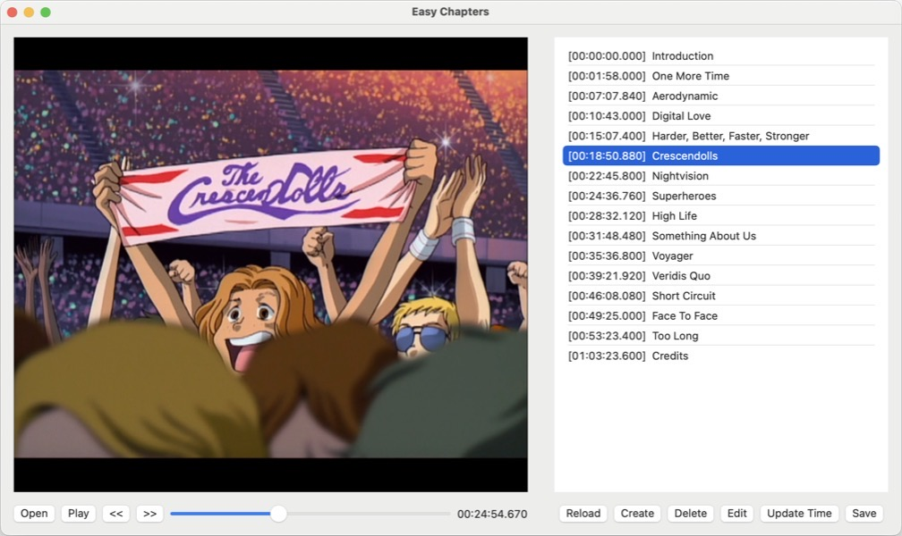
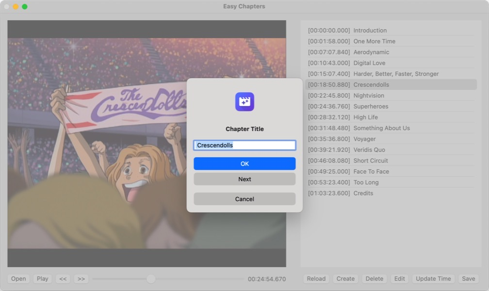

# easy-chapters

MacOS application to edit chapters in a video file.

## Prequisites

Requires [ffmpeg](https://ffmpeg.org) to be installed. If it is not in shell-less PATH, following locations are checked (in that order):
 - /opt/homebrew/bin/ffmpeg
 - /opt/local/bin/ffmpeg
 - /usr/local/bin/ffmpeg
 - /usr/bin/ffmpeg

 If you installed ffmpeg with [Homebrew](https://brew.sh), that version should therefore be used.

## Screenshots

 

